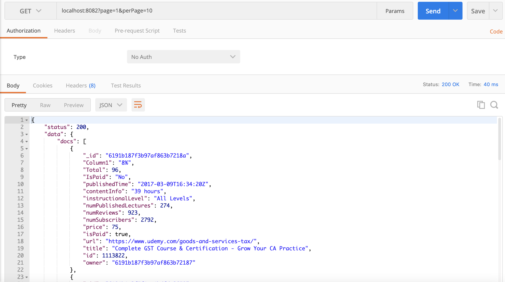
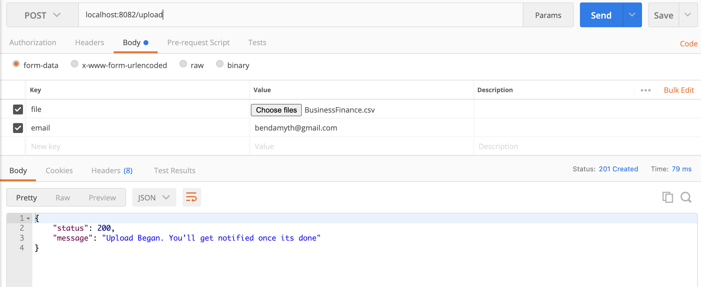
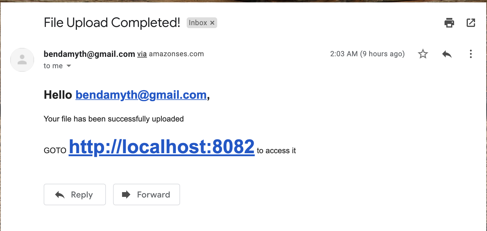

# Ankora Task

Allows a user to upload CSV files in an asynchronous fashion, i.e sends the file to a queue for processing and gives a user instant feedback, then sends a notification to user email once the file has been completely processed (or uploaded).

### Key Services

- Nestjs for project setup and architecture
- MongoDB for Database
- Nestjs using `Bull` and `Redis` for Queue
- Nestjs file interceptors for file upload
- `AWS SES` for mailing

### Setup

Begin by cloning the project repo, the `cd` into folder after cloned
Then change the `.env.example` file to `.env` and put in the appropiate data
Then run the following command

**if using yarn**
`yarn`
`yarn start:dev`

**if using npm**
`npm install`
`npm run start:dev`

### API Doc

The api has only 2 endpoints

- `GET: /` access your uploaded data using a get pagination supported interface
- `POST: /upload` upload your csv file for storage on the server

**EXAMPLE** `GET: /`

**EXAMPLE** `POST: /upload`

Then you should get an email that look like this once the file upload is done

